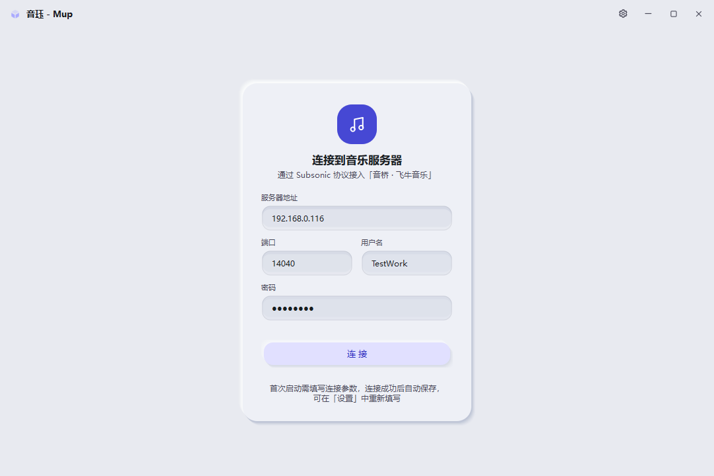
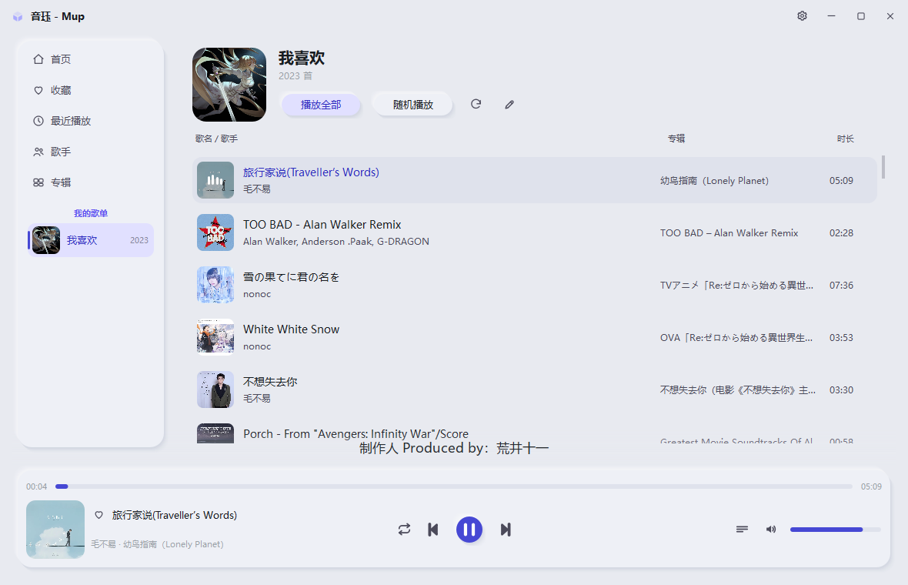
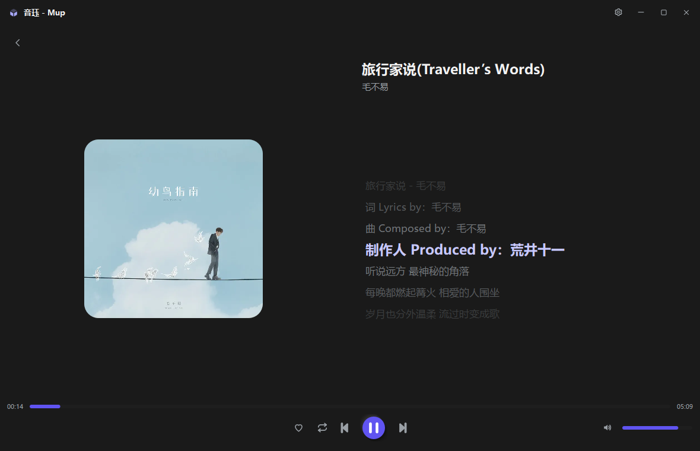
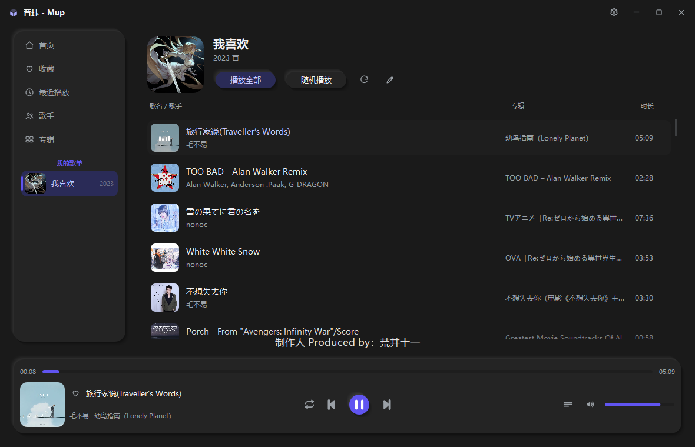

# 音珏 - Mup

通过 **Subsonic 协议**连接飞牛音乐的轻量 Windows 音乐播放器，界面参考 QQ 音乐布局，采用 DESIGN.md 的新拟态（Neumorphism）设计语言，本身不连接飞牛官方 API，而是通过 **音桥（Yinqiao）**（[fn-music-bridge](https://github.com/qianlipp/fn-music-bridge)）将飞牛音乐转接为 Subsonic 协议后接入。

> 当前为符合个人需求的半成品，想要完善细节或者继续开发可以用提示词 "首先通过"./项目细节描述.md"理解程序" 开头后提出具体需求即可。

## 特性

- 🎨 **新拟态 UI**：Extruded Light 浅色风格 + 靛蓝主色，默认跟随系统深浅色（可在设置切换）
- 🗂 **三界面**：连接服务器页 → 歌单页 → 沉浸页
- 🎧 **基础播放**：播放/暂停、上/下一曲（实心三角）、进度拖动、音量（静音记忆 + 调整时显示百分比）、收藏；播放栏爱心前置、歌名跑马灯
- 📥 **完整歌单**：音桥 Subsonic 仅返回前 50 首时，自动改用 **Jellyfin 协议**补全完整歌单（「我喜欢」2023 首）；两段式加载（先 50 首秒开，后台补全全量）；侧边栏显示真实歌曲数
- 🖼 **自定义封面**：音桥不同步飞牛自定义歌单封面 → 点编辑(铅笔)按钮可选本地图片作为歌单封面（服务器封面/自定义封面可切换），持久化保存
- ♻️ **重启恢复**：默认打开上次歌单并显示上次歌曲（不自动播放、恢复进度），音量/播放模式/**窗口尺寸**一并恢复
- 🔀 **播放模式**：随机 / 顺序 / 单曲循环 / 列表循环（单按钮弹出菜单切换）
- 📚 **完整音乐库导航**：我的歌单（与导航唯一选中互斥）/ 专辑网格 / 歌手（左列按歌曲数排序 + 右侧歌曲）/ 收藏 / 最近播放
- 📊 **可排序列表**：点击列头循环切换排序；歌曲行悬浮播放指示 + 当前播放四柱白色动画；**歌手名/专辑名可点击跳转**
- 🖼 **沉浸页**：左右 50% 分栏、封面随窗口自适应、点播放栏封面动画放大过渡（其它内容渐变出现）；大封面圆形/方形切换；随播放滚动高亮歌词
- 🎤 **迷你歌词**：播放栏上方显示当前句，背景底部半透明→顶部全透明渐变
- ⌨️ **全局快捷键**：系统媒体键（低级键盘钩子）+ 自定义组合键（Ctrl+Alt+P 等）
- ⚡ **低占用**：纯 QWidget、歌曲列表虚拟化渲染、封面异步加载 + LRU 缓存、歌单加载缓存，万首歌曲流畅
- 🪟 **无边框窗口**：自定义标题栏（含设置入口，沉浸页也常显）+ 原生边缘缩放 + **双击标题栏最大化/还原**

## 截图






## 快速开始

```bash
# 安装依赖
pip install -r requirements.txt

# 运行
python main.py
```

首次启动填写「音桥」的连接参数（服务器 IP、端口、用户名、密码），连接成功后参数会自动保存，下次启动自动重连。

### 音桥配置（可选）

1. 在飞牛 NAS 上安装 [音桥](https://github.com/qianlipp/fn-music-bridge/releases)
2. 开启 Subsonic 协议并记录端口
3. 在本程序连接页填写音桥地址与飞牛音乐账号即可

## 全局快捷键

| 功能 | 默认键 | 系统媒体键 |
|---|---|---|
| 播放 / 暂停 | `Ctrl+Alt+P` | 播放/暂停键 |
| 下一曲 | `Ctrl+Alt+→` | 下一曲键 |
| 上一曲 | `Ctrl+Alt+←` | 上一曲键 |
| 音量 + | `Ctrl+Alt+↑` | 音量+键 |
| 音量 - | `Ctrl+Alt+↓` | 音量-键 |

自定义快捷键在 `config.json` 的 `hotkeys` 字段修改。

## 技术栈

Python 3.10 · PySide6 (Qt Widgets) · requests · QMediaPlayer · Win32 API

## 项目结构

```
main.py                  入口
app/
  config.py              配置持久化
  subsonic_client.py     Subsonic 客户端
  cover_manager.py       封面异步加载与缓存
  player.py              播放核心（队列 + 播放模式）
  hotkeys.py             全局快捷键
ui/
  theme.py               DESIGN.md 主题
  widgets.py             新拟态控件库
  windows.py             无边框主窗口 / 过渡动画
  pages/                 连接页 / 歌单页 / 沉浸页
```

详见 [项目细节描述.md](项目细节描述.md)。

## 致谢

- [音桥 fn-music-bridge](https://github.com/qianlipp/fn-music-bridge) —— 把飞牛音乐转接为 Subsonic 等协议
- [Subsonic API](http://www.subsonic.org/pages/api.jsp) —— 开放音乐流媒体协议

## 许可证

MIT License
